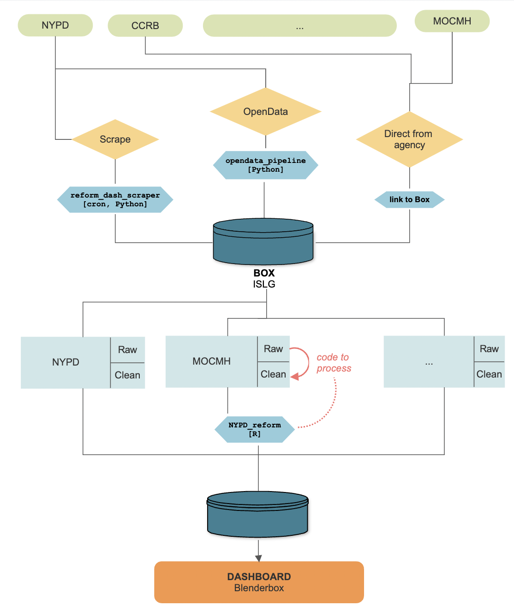

```{r, echo=FALSE}
#devtools::install_github("hadley/emo")
```


```{css, echo=FALSE}
.left-column {
  color: #777;
  width: 40%;
  height: 100%;
  float: center;
}
.left-column h2:last-of-type, .left-column h3:last-child {
  color: #000;
}
.right-column {
  width: 60%;
  float: right;
  padding-top: 3em;
}
```

# `r emo::ji("sparkles")` Today's Game Plan `r emo::ji("sparkles")`

1. Workflow overview

2. Data collection set up
   - OpenData
   - Scraping
   - Sent from agency
   
3. Reading/writing data on Box 
   - Boxr
   - Box Sync
   - Box.com
     
4. Data storage folder structure
 - Agency 
 - Bucket? 
 - Metric?
 
5. Next time: Code repository and Code reviews

---

<p align="center">

</p >

---

# Tools & Software

--

- Box / <a href="https://support.box.com/hc/en-us/articles/360043697194-Installing-Box-Sync" target="_blank">Box Sync</a>

  + We will use Box to store raw and clean data. <a href="https://islgcunyedu.app.box.com/folder/194970922440" target="_blank">[here]</a> No data will be stored in Git repository. 

--

- `Git` / GitHub

  + `NYPD_Reform` will be our team's primary codebase, which we will use to track and review scripts <a href="https://github.com/gh-islg/NYPD_Reform" target="_blank">[here]</a>
  
  + `reform_dash_scraper` is separate repository used for automated scraping. <a href="https://github.com/gh-islg/reform_dash_scraper" target="_blank">[here]</a>
  
--
     
- `R` / `RStudio`


---

# Overview of process

--

- Data collection streams:
  1. OpenData <span style='color: steelblue;'>(Annie)</span>
  2. Scraped via cron job <span style='color: steelblue;'>(Annie)</span> 
  3. Agencies drop us data through Box folder  <span style='color: steelblue;'>(Jamel & Melanie)</span> 

--

- Wrangling <span style='color: steelblue;'>(Jamel, Melanie  & Annie)</span>


--

- QA and Code review <span style='color: steelblue;'>(Jamel, Melanie  & Annie)</span>
  
--

- Pushing to Blenderbox's database can be done either:
 1. programmatically or  <span style='color: steelblue;'>(Annie)</span>
 2. with drag/drop UI <span style='color: steelblue;'>(Jamel & Melanie)</span>

---
class: inverse, middle, center

#`r emo::ji("car")`  **An example: vehicle stops**  `r emo::ji("car")`


---

# What is Git and GitHub? Why Git?
.left-column[

<div style="visibility: hidden; height: 130px;">
  CSS+markdown combo not cooperating...so jank sol'n
</div>

]

.right-column[
- a popular Version Control System (VCS)
 + git creates a "snapshot" of your code and allows you manage your code history

- [GitHub](https://www.github.com/) is the cloud-based service that helps us keep track of Git repositories

- many people can work on chunks of code simultaneously within a project

]

---

# Structure of NYPD_Reform Repository

---

<!-- ### Lab -->

<!-- 1. Create a new file `my_file_<your-name>.txt` (e.g., `my_file_ayc.txt`) in the local repository. Populate the text file with whatever you want.  -->

<!-- -- -->

<!-- 2. Type **`git status`** in your terminal. What do you see?  -->
<!-- -- -->

<!-- 3. Stage `my_file_<your-name>.txt` by executing:  -->
<!-- ```cli -->
<!-- $ git add my_file_<your-name>.txt -->
<!-- ``` -->
<!-- -- -->

<!-- 4. Write an informative comment about the changes you made. -->
<!-- ```cli -->
<!-- $ git commit -m "create new script" -->
<!-- ``` -->
<!-- -- -->

<!-- 5. Send it to the remote repository. (`main` is the name of the master branch.) -->
<!-- ```cli -->
<!-- $ git push -u origin main -->
<!-- ``` -->

<!-- --- -->

<!-- # Additional resources -->

<!-- - My preferred git [cheatsheet](https://www.atlassian.com/git/tutorials/atlassian-git-cheatsheet) was created by Atlassian (owners of BitBucket), but there are many others. E.g., from [GitHub](https://training.github.com/downloads/github-git-cheat-sheet.pdf) or this [interactive]((https://ndpsoftware.com/git-cheatsheet.html#loc=index) one. -->

<!-- - All git [commands](https://git-scm.com/docs/git#_git_commands). -->

<!-- - Perhaps my favorite git reference of all is [ohshitgit](https://ohshitgit.com/) (or the child-friendly [dangitgit](https://dangitgit.com/en)). Some of this content is on slides 20 & 21! -->

